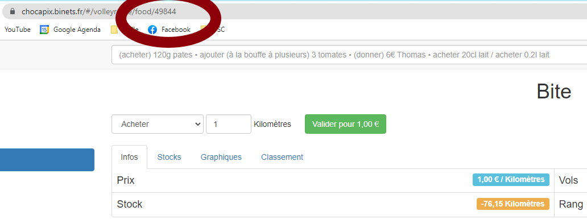

# LABORATOIRE CHOCAPIX

## Introduction

Je me suis un peu amusé avec Chocapix (RIP mes révisions de pâles). Je mets ici ce que j'ai fait.

Avant toute chose, lancez `pip3 install -r requirements.txt` la commande pour installer les bibliothèques Python que j'ai utilisées et `sudo apt install python3.8-tk` pour installer Tkinter, une bibliothèque qui permet de développer facilement un GUI.

## amende.py

Ce script permet de mettre des amendes à n'importe qui de votre section ! Tout d'abord, modifiez le fichier python en y mettant votre nom d'utilisateur et mot de passe Chocapix ainsi que le code de l'aliment qui sera considéré comme une amende:
```
####INFO TO CHANGE#####
your_username = "YOUR USERNAME"
your_pass = "YOUR PASS"
amende_food = 49844
####INFO TO CHANGE#####
```

Pour trouver ce code, rendez-vous sur la page chocapix de l'aliment via l'onglet > Aliments > [L'ALIMENT QUE VOUS VOULEZ]. Il ne reste plus qu'à regarder le nombre à la fin du lien :


Lancez le script avec la commande `python3 amende.py` et appréciez !


## brute_force.py

Ce script permettrait (au conditionnel parce qu'en pratique c'est trop long !) de changer le mot de passe de n'importe quel utilisateur Chocapix.

En me balandant un peu sur l'API, j'ai vu qu'on pouvait réinitialiser le mot de passe de n'importe quel utilisateur Chocapix en une chaine aléatoire de 6 caractères à base de lettres minuscules et chiffres (attention, ça lui envoie un mail !). Ça fait donc  possibilités. J'ai alors essayé de brute force le mot de passe avec un script Python en multithreadings. Une fois le mot de passe trouvé, le programme le modifie en ce que vous voulez. Par défaut, le script exécute 100 threads et change le mot de passe en "Hello". Vous pouvez changer les paramètres directement dans le fichier Python :
```
##### INFO TO CHANGE
new_password = "Hello"
nb_threads = 100
##### INFO TO CHANGE
```
En pratique, ça prend trop longtemps. Pour trouver le mot de passe généré aléatoirement, faudrait laisser tourner le programme de l'ordre de la centaine de jours.
